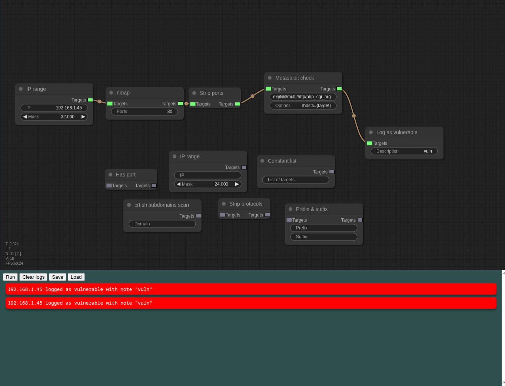

# overflow
Vulnerability scanning using graphs!



## How to use
Install this tool using NPM:
```bash
npm i overflow-scanner -g
```
Then, you can simply run it with
```bash
overflow-scanner
```
and visit http://localhost:2003. That is the web interface.

> Please note: some nodes require their corresponding programs to be installed and in PATH (e. g. nmap). If they're not installed, the nodes **will not work** and **will throw an error**!

On the top, you can edit the scanner graph - double click to create new nodes, drag and drop to create connections.

On the bottom, there are controls and logs.

## Supported integrations
- [Metasploit](https://www.metasploit.com)
- [nmap](https://nmap.org)
- [crt.sh](https://crt.sh)
- [Burp Suite](https://portswigger.net/burp)
- [Sublist3r](https://github.com/aboul3la/Sublist3r)
- [ZAP](https://www.zaproxy.org/)
- [sqlmap](https://sqlmap.org/)